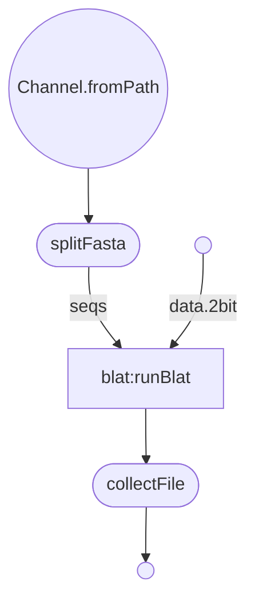

THIS REPO IS 🚧 UNDER CONSTRUCTION 🚧 and NOT Used in ANY production CODE
# Nextflow Conversion of GenomeAlignWithGfClientTask

***
blat
***  

### Get Started
  * Install Nextflow
    
    `curl https://get.nextflow.io | bash`

## Usage

Main parameters:

| param         | value type        | description  |
| ------------- | ------------- | ------------ |
| seqFile  | string | Path to input fasta file |
| fastaSubsetSize | integer | How many sequences per split of input file |
| databasePath | string | Path to database Files |
| outputDir  | string  | publish directory |
| maxIntron | integer | Maximum intron size (Default 750000) |
| dbType | string | "dna" / "prot" / "dnax" (DNA sequence translated in six frames to protein). Default is dna. |
| queryType | string | "dna" / "prot" / "dnax" (DNA sequence translated in six frames to protein) "rnax" (DNA sequence translated in three frames to protein) |
| blatParams | string | Additional parameters for gfClient |
| trans | boolean | Translate database to protein in 6 frames |

### Example 

 `nextflow run https://github.com/VEuPathDB/blat -with-trace -c  <config_file> -r main`
